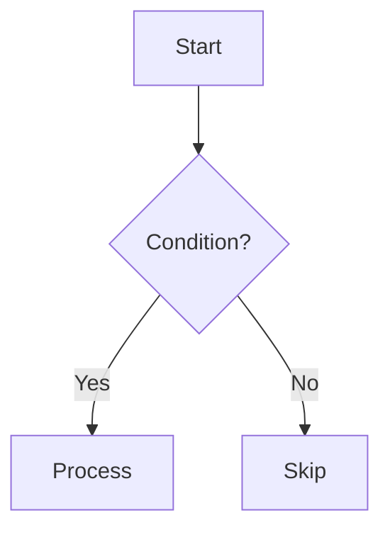

# Contributing to DSA Mastery Platform

Thank you for your interest in contributing! This platform aims to help thousands of students master DSA and crack interviews. Every contribution matters.

---

## 🎯 How You Can Contribute

### 1. Add New Problems
Help us expand our problem library (target: 230+ problems).

**What we need:**
- Unsolved problems from LeetCode, Codeforces, etc.
- Company-specific interview questions
- OA (Online Assessment) problems

**How to add:**
1. Follow the [Problem Template](#problem-template)
2. Create file in appropriate folder: `topics/[topic]/problems/[difficulty]/problem-name.md`
3. Include all sections (statement, approaches, edge cases, etc.)
4. Test your C++ code
5. Submit pull request

### 2. Improve Explanations
Make complex concepts simple and intuitive.

**What we need:**
- Better real-world analogies
- Clearer step-by-step explanations
- More intuitive ASCII diagrams
- Additional examples

**How to improve:**
1. Find explanation that could be clearer
2. Rewrite with your understanding
3. Add diagrams if helpful
4. Submit pull request

### 3. Add Company-Specific Questions
Share your interview experiences.

**What we need:**
- Amazon interview questions
- Google interview questions
- Meta interview questions
- Microsoft interview questions
- OA patterns from any company

**How to add:**
1. Create file in `04-CompanyPrep/[Company]/question-name.md`
2. Include problem, approach, and your experience
3. Submit pull request

### 4. Fix Bugs and Errors
Help us maintain quality.

**What we need:**
- Incorrect time/space complexity
- Bugs in C++ code
- Wrong edge cases
- Broken links

**How to fix:**
1. Open issue describing the bug
2. Fix it in a branch
3. Submit pull request

### 5. Add Features to Website
Help build the interactive platform.

**What we need:**
- New components
- UI improvements
- Bug fixes
- Performance optimizations

**How to contribute:**
1. Check [Issues](../../issues) for "help wanted" or "good first issue"
2. Fork the repository
3. Create feature branch
4. Make changes
5. Submit pull request

---

## 📝 Problem Template

Every problem MUST follow this structure:

```markdown
# Problem Name

## 📋 Problem Statement
[Clear description with input/output format]

## 🌍 Real-World Context
[Why this problem matters - actual company use case]

## 📊 Examples
### Example 1
**Input:** ...
**Output:** ...
**Explanation:** [Step-by-step walkthrough]

## 🎯 Constraints
- [List all constraints]

## 💡 Pattern Recognition
**Problem Type:** [Two Pointer / Sliding Window / DP / etc.]
**Key Indicators:** [What tells you this pattern?]
**Similar Problems:** [Link to 3-5 related problems]

## 🔍 Approach 1: Brute Force
**Time:** O(...) | **Space:** O(...)
**Idea:** [Simple explanation]

### Pseudocode
```
[step-by-step logic]
```

### C++ Code
```cpp
// Complete, well-commented code
```

---

## 🚀 Approach 2: Better
**Time:** O(...) | **Space:** O(...)
**Idea:** [What optimization we're applying]

### C++ Code
```cpp
// Complete code
```

---

## ⚡ Approach 3: Optimal
**Time:** O(...) | **Space:** O(...)
**Idea:** [Final optimized solution]

### Flowchart (Mermaid)


### C++ Code
```cpp
// Complete code
```

---

## 🧪 Edge Cases
1. **Empty input:** [What happens? How to handle?]
2. **Single element:** [...]
3. **Maximum constraints:** [...]

## 🎤 Interview Talking Points
**What interviewer wants to hear:**
- [Key points to mention]
- [Trade-offs to discuss]
- [Follow-up questions]

## ✅ Test Cases
```cpp
// 5-8 test cases with expected output
```

## 📝 Common Mistakes
1. [Off-by-one errors]
2. [Wrong loop condition]
3. [Not handling edge case]

## 🔄 Revision Notes
**Key pattern:** [One-line reminder]
**Template:** [5-line code skeleton]
**Trick:** [One special thing to remember]

## 🔗 Related Problems
- [Problem 1](link) - Same pattern
- [Problem 2](link) - Variation
- [Problem 3](link) - Harder version
```

---

## 🎨 Code Style Guidelines

### C++ Code Standards

**Naming:**
- Variables: `snake_case` (e.g., `max_sum`, `left_ptr`)
- Functions: `camelCase` (e.g., `findMaxSum()`, `isValid()`)
- Classes: `PascalCase` (e.g., `Solution`, `TreeNode`)

**Comments:**
- Explain WHY, not WHAT
- Comment complex logic
- Add time/space complexity

**Example:**
```cpp
// GOOD: Explains the reasoning
// Use two pointers to avoid O(n²) nested loop
int left = 0, right = arr.size() - 1;

// BAD: States the obvious
// Initialize variables
int left = 0, right = arr.size() - 1;
```

**Formatting:**
- Use 4 spaces for indentation
- Add spaces around operators
- One statement per line
- Use braces even for single-line blocks

---

## 📚 Content Guidelines

### Writing Style

**DO:**
- ✅ Use real-world analogies
- ✅ Explain concepts simply (like teaching a 10-year-old)
- ✅ Include visual diagrams (ASCII or Mermaid)
- ✅ Show multiple approaches
- ✅ Discuss trade-offs
- ✅ Add interview tips

**DON'T:**
- ❌ Use textbook definitions without examples
- ❌ Skip the "why" behind approaches
- ❌ Provide only optimal solution
- ❌ Ignore edge cases
- ❌ Use generic explanations

### Difficulty Ratings

**Easy:**
- Direct pattern application
- < 15 minutes to solve
- Basic data structure usage

**Medium:**
- Requires pattern combination
- 30-45 minutes to solve
- Multiple data structures
- Edge case handling

**Hard:**
- Non-obvious pattern
- 60+ minutes to solve
- Advanced optimization
- Complex edge cases

---

## 🔄 Pull Request Process

### Before Submitting

1. **Test your code**
   - Compile and run all test cases
   - Check edge cases
   - Verify complexity analysis

2. **Follow template**
   - All sections included
   - Proper formatting
   - No broken links

3. **Review your content**
   - Spelling and grammar
   - Code comments
   - Clear explanations

### Submitting PR

1. **Fork the repository**
2. **Create feature branch**
   ```bash
   git checkout -b feature/add-two-sum-problem
   ```

3. **Make changes**
   - Add problem file
   - Test thoroughly
   - Update topic README if needed

4. **Commit with clear message**
   ```bash
   git commit -m "Add Two Sum problem (Arrays/Easy) with 3 approaches"
   ```

5. **Push and create PR**
   ```bash
   git push origin feature/add-two-sum-problem
   ```

6. **Fill PR template**
   - Describe what you added
   - Link related issues
   - Mention testing done

### PR Review

Maintainers will check:
- ✅ Code correctness
- ✅ Explanation quality
- ✅ Template compliance
- ✅ No plagiarism
- ✅ Proper attribution

---

## 🐛 Reporting Issues

### Bug Reports

**Include:**
- Problem file path
- Description of bug
- Expected vs actual behavior
- Screenshots (if applicable)

**Example:**
```
File: 01-Foundations/02-Arrays/problems/easy/two-sum.md
Bug: Time complexity says O(n) but code is O(n²)
Expected: O(n) with hash map solution
Actual: Brute force solution labeled as optimal
```

### Feature Requests

**Include:**
- Clear description
- Use case
- Expected behavior
- Priority (low/medium/high)

---

## 🏆 Recognition

Contributors will be recognized in:
- README.md contributors section
- Release notes
- Special mentions for major contributions

**Top contributors may:**
- Become maintainers
- Help shape platform direction
- Get featured in blog posts

---

## 💡 Tips for Quality Contributions

### Before Writing

1. **Solve the problem yourself first**
   - Don't copy from other sources
   - Understand all approaches
   - Find your own insights

2. **Research thoroughly**
   - Check multiple sources
   - Verify complexity analysis
   - Test edge cases

3. **Think like a learner**
   - What confused you initially?
   - What helped you understand?
   - What would you want to know?

### While Writing

1. **Be specific**
   - Instead of "use hash map", say "store complement → index mapping"
   - Instead of "it's faster", say "reduces from O(n²) to O(n)"

2. **Add value**
   - Unique insights from your experience
   - Interview tips you learned
   - Common mistakes you made

3. **Keep it simple**
   - Short sentences
   - Active voice
   - Concrete examples

### After Writing

1. **Self-review**
   - Read aloud (catches awkward phrasing)
   - Check for consistency
   - Verify all code compiles

2. **Get feedback**
   - Ask friends to review
   - Test with beginners
   - Iterate based on feedback

---

## 📞 Getting Help

- **Questions?** Open a [Discussion](../../discussions)
- **Bugs?** Open an [Issue](../../issues)
- **Chat?** Join our Discord (coming soon)

---

## 🙏 Thank You

Every contribution, no matter how small, helps someone learn DSA better.

**Together, we're building the best DSA learning resource.**

Happy contributing! 🚀
